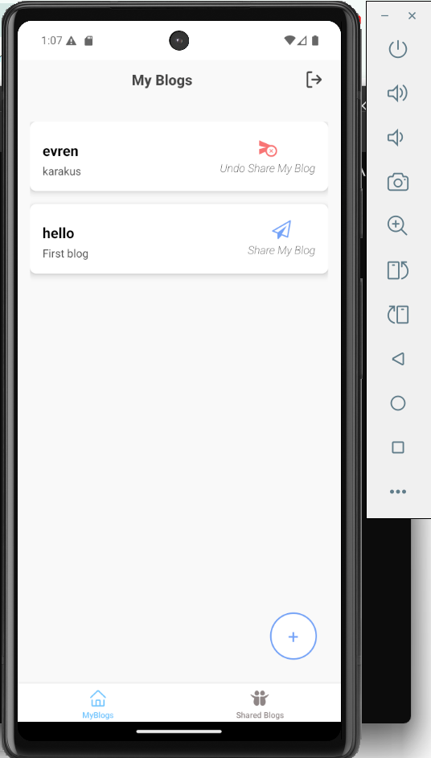
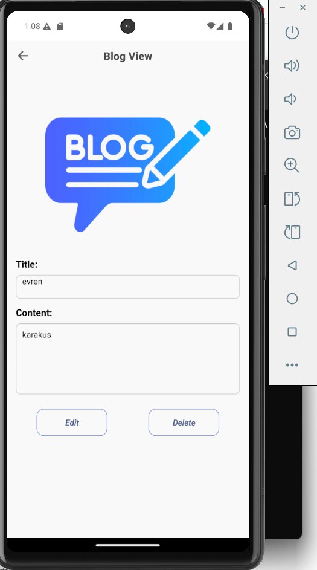
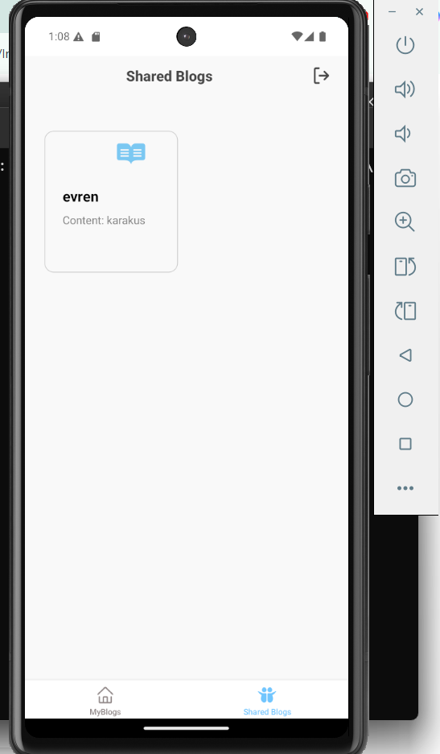

# 🌟 BlogApp React Native 🌟

Welcome to my BlogApp, a dynamic and feature-rich React Native application designed for seamless blog creation and sharing.  This app leverages the power of Firebase and Expo SQLite to provide a robust and user-friendly blogging experience.

## 📱 Features

✨  **Authentication:** Secure user authentication with Firebase Authentication.

🚀  **Local Storage:** Persistent local blog storage using Expo SQLite and Drizzle ORM for offline access and quick editing.

🔥  **Shared Blogs:** Real-time synchronization of blogs and user data with Firebase Firestore, enabling collaborative blogging and sharing.

🌍  **Seamless Synchronization:** Local and shared blogs work in harmony, ensuring a smooth transition between offline and online modes. Changes made locally are automatically synced when online.

🌈  **Modern UI/UX:** Intuitive and responsive user interface built with React Native and Expo Router for smooth navigation.

🛠️  **Extensible Architecture:**  Clean code structure making it easy to add new features and maintain the app.

## ⚡️ Technologies Used

*   **React Native:** The framework for building native mobile apps with JavaScript.
*   **Expo Router:**  For efficient and declarative navigation.
*   **TypeScript:**  For enhanced code quality and maintainability.
*   **Firebase Authentication:** Secure user authentication.
*   **Firebase Firestore:** Real-time NoSQL database for shared blog and user data.
*   **Expo SQLite:**  For local database storage.
*   **Drizzle ORM:**  Type-safe and efficient database access with Expo SQLite.
*   **Context API:**  For managing application state.

## ⚡️ Getting Started

To run BlogApp on your local machine, follow these steps:

1.  **Clone the repository:**

    ```bash
    git clone https://github.com/blackbird-tr/BlogApplication.git  
    ```

2.  **Install dependencies:**

    ```bash
    cd BlogApp
    npm install  // or yarn install
    ``` 
3.  **Start the development server:**

    ```bash
    npx expo start // or expo start
    ```

## 💡 Usage

BlogApp allows users to:

*   **Create Local Blogs:** Draft and save blogs locally for offline access.
*   **View Local Blogs:** Browse and read blogs locally.
*   **Delete Local Blogs:** Delete blogs locally.
*   **Update Local Blogs:** Update blogs locally.
*   **Create Shared Blogs:** Publish blogs to Firebase Firestore to share with other users.
*   **View Shared Blogs:** Browse and read blogs shared by other users.
*   **Update Shared Blogs:** Update blogs to Firebase Firestore.
*   **Delete Shared Blogs:** Delete blogs to Firebase Firestore.
*   **Sync Blogs:** Changes made locally are automatically synced with Firestore when online, and vice-versa.
*   **Authenticate:** Securely sign up/sign in using Firebase Authentication.

## 🔄 Some Images

<p align="center">
  
   
  
</p>

## 🎉 Contact

For any questions, suggestions, or feedback, please feel free to reach out:

*   [GitHub](https://github.com/blackbird-tr)
*   [LinkedIn](www.linkedin.com/in/evren-blackbird-0a4601264)


Happy Blogging! 🚀
